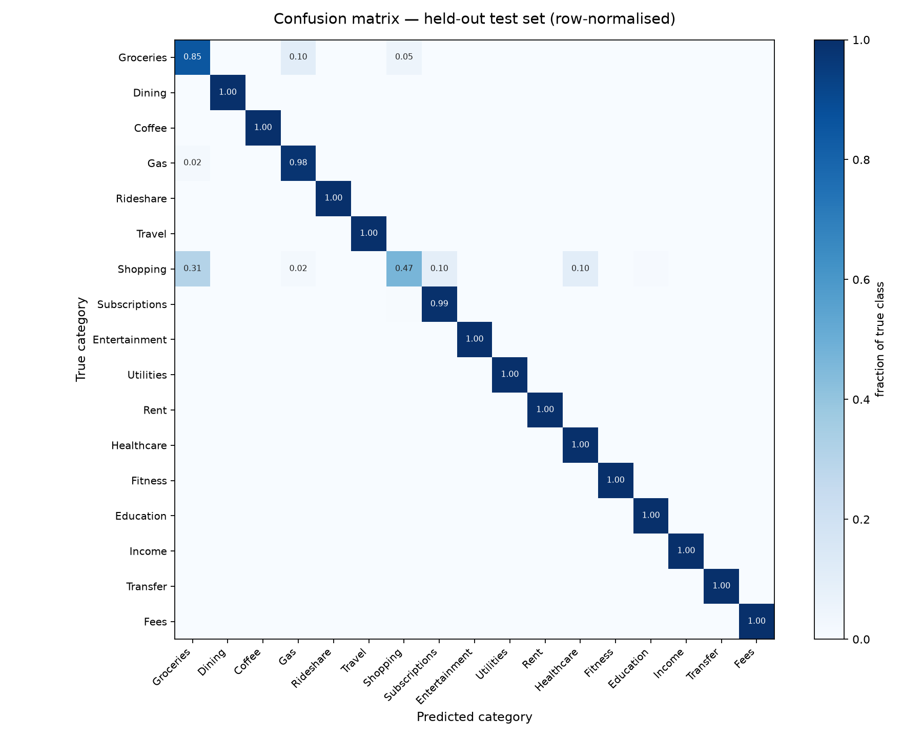

# Transaction Categorization for Budget Tracking

ECE 49595 Senior Design I — Exercise 3 (Learn a Skill)
**Author:** [Srikar Mallajosyula] · **Team:** [9]

Turning raw bank transaction descriptions into the budget categories our app
tracks, with a confidence score and a review queue for the ones the system
should not guess at.

```
[debit] SQ *BLUE BOTTLE SAN FRANCISCO CA   ->  Coffee   ->  Food & Drink   (0.98)
[debit] AMZN MKTP US*2K4L91                ->  Shopping ->  Shopping       (0.98)
[credit] VENMO CASHOUT*4419MZ              ->  Income   ->  Income         (0.96)
[debit] SQ *MORNING GLORY BAKEHOUSE        ->  Needs Review  (unknown merchant)
```

---

## Why this exists

Our project is a budgeting assistant. Every feature downstream of the bank
connection needs to know *what a purchase was*, not just that it happened:

- **Budgets are per-category.** A $300 monthly dining limit is meaningless
  unless each transaction is assigned to Dining.
- **Alerts consume categories.** My teammate's notification logic takes
  per-category spend as input; this module produces it.
- **Plaid does not finish the job.** We plan to use Plaid, but it returns its
  own fixed taxonomy and attaches a confidence level that can be LOW. Our app
  still needs a mapping into *our* budget categories and a decision about what
  to do when confidence is poor. Plaid is not yet integrated, so this module
  also serves as the stand-in until it is.

**Skill being learned:** short-text classification on noisy financial strings —
feature engineering for abbreviated merchant text, probability calibration,
honest evaluation design, and confidence-gated inference.

---

## Results

Produced by `python scripts/evaluate.py`. Full tables in
[`results/results.md`](results/results.md); raw numbers in
[`results/metrics.json`](results/metrics.json).

| Approach | Test accuracy | Test macro-F1 | Unseen-merchant macro-F1 | Median latency |
|---|---|---|---|---|
| Rule baseline (21 hand-written rules) | 0.580 | 0.719 | 0.749 | <1 ms |
| TF-IDF + calibrated logistic regression | **0.962** | **0.955** | 0.382 | 3.4 ms |

The trained model beats the rule baseline by **23.6 macro-F1 points** on
familiar merchants, and loses badly to it on merchants it has never seen. That
contrast is the main finding of this exercise, and it is why the shipped
pipeline uses both:

| Shipped pipeline | Auto-categorized | Accuracy when auto | Sent to review |
|---|---|---|---|
| Familiar merchants | 97.0% | 97.8% | 3.0% |
| New merchants | 76.8% | 92.0% | 23.2% |



---

## Quickstart

```bash
git clone https://github.com/[YOUR-USERNAME]/transaction-categorizer.git
cd transaction-categorizer
python -m venv .venv && source .venv/bin/activate    # Windows: .venv\Scripts\activate
pip install -r requirements.txt

python scripts/generate_data.py    # build train / test / unseen-merchant splits
python scripts/train.py            # train and save the model (~3 s)
python scripts/evaluate.py         # metrics, confusion matrix, threshold sweep
python scripts/demo.py --budgets   # categorize a sample statement + budget rollup
python -m pytest tests/ -v         # 17 tests
```

Optional local-LLM comparison (requires [Ollama](https://ollama.com)):

```bash
ollama pull llama3.2:3b
python scripts/evaluate.py --llm --llm-samples 100
```

### Using it from other modules

```python
from src.categorize import categorize, spending_by_budget_category

result = categorize("[debit] SQ *BLUE BOTTLE SAN FRANCISCO CA", amount=6.25)
result.budget_category   # "Food & Drink"
result.confidence        # 0.98
result.needs_review      # False
result.decided_by        # "model" | "rules" | "needs_review"

spending_by_budget_category(transactions)   # {"Bills & Housing": 1298.44, ...}
```

---

## How it works

```
raw description
      |
      v
 normalize()            strip store numbers, reference codes, dates
      |
      v
 TF-IDF features        word 1-2 grams  +  character 3-5 grams
      |
      v
 calibrated logistic regression  -->  category + trustworthy probability
      |
      +-- confident?           --> use it
      +-- unknown merchant? ---+
      +-- low confidence?  ----+--> keyword rules --> matched? use it
                                                  --> no match?  Needs Review
      |
      v
 budget category  (17 source categories -> 8 app budget categories)
```

| File | Purpose |
|---|---|
| `src/categories.py` | The two taxonomies and the mapping between them |
| `src/data_generator.py` | Synthetic statement generator with held-out merchants |
| `src/rules.py` | Keyword baseline, also used as the fallback layer |
| `src/ml_model.py` | Features, training, calibration, confidence gate, OOV check |
| `src/llm_classifier.py` | Optional local-LLM (Ollama) comparison arm |
| `src/categorize.py` | The public API other modules import |
| `scripts/` | generate_data · train · evaluate · demo |
| `tests/` | 17 tests covering taxonomy, rules, normalisation, pipeline |

### Design decisions worth explaining

**Word features plus character features.** Word n-grams capture merchant
tokens; character n-grams survive the glued-together abbreviations word
tokenisation destroys (`AMZN MKTP US*2K4L91`). Character features are also the
only reason an unseen merchant like `REI.COM*K92LMQ4` is classified correctly.

**Calibration.** A raw logistic-regression score is not a probability. With
calibration, "0.9 confidence" corresponds to being right about 90% of the time,
which is what makes the confidence threshold meaningful rather than arbitrary.

**Two independent reasons to send something to review.** Low probability is the
obvious one. The second is out-of-vocabulary coverage: if most tokens in a
description were never seen in training, the merchant is new, and even a
confident-looking score deserves a second look. In the demo,
`SQ *MORNING GLORY BAKEHOUSE` scores 0.93 and is still flagged — correctly.

**Leakage control.** Exact-duplicate descriptions are removed before splitting,
and held-out merchants are asserted absent from training. Without these,
evaluation scores are inflated and meaningless.

---

## What I learned the hard way

**A normalisation regex nearly sank the project.** My first noise-stripping
pattern replaced any uppercase token of six or more characters with a
placeholder, which was meant to remove reference codes. It also removed
`STARBUCKS`, `KROGER` and every other merchant name. Test accuracy sat at 0.699
and I assumed the model architecture was wrong. It was the preprocessing.
Fixing the regex to only collapse tokens *mixing letters and digits* moved
accuracy to 0.962 with no model change at all.

**Memorisation is not generalisation.** The model scores 0.955 macro-F1 on
familiar merchants and 0.382 on merchants withheld from training. The same
model, the same categories — the only difference is whether it had seen the
merchant name. If I had only reported the first number, the result would have
been a fiction.

**High precision with low coverage is still valuable.** The rule baseline is
correct 94% of the time when it fires but only fires on 62% of transactions.
That profile is useless alone and excellent as a fallback, which is why the
final pipeline consults it exactly when the model is unsure.

**The remaining errors are mostly real ambiguity.** The largest confusion block
is Shopping predicted as Groceries, driven by merchants like Target, Walmart
and Costco that genuinely sell both. No classifier fixes that from the
description alone; only the user knows. That is a confidence-gate problem, not
a model problem.

---

## Limitations

- **Training data is synthetic.** It reproduces real statement *formats*, but
  it is generated. Published results on real bank data report far lower scores
  (roughly 60–73% accuracy), so treat 0.96 as an upper bound, not a forecast.
- **The category set is fixed.** Users cannot yet define custom budget
  categories.
- **No learning from corrections.** When a user fixes a category, nothing
  currently feeds that back into the model.
- **Amount is not used as a feature.** Only the description and direction are.
- **The local-LLM arm is optional** and only runs if Ollama is installed.

---

## Next steps

1. Swap the synthetic data for real descriptions once Plaid is connected, and
   re-measure everything against Plaid's own categories.
2. Add a correction loop: store user fixes as labeled data and retrain.
3. Route review-queue items to a local LLM so fewer reach the user.
4. Expose `categorize_batch` behind the API my teammate's display layer calls.